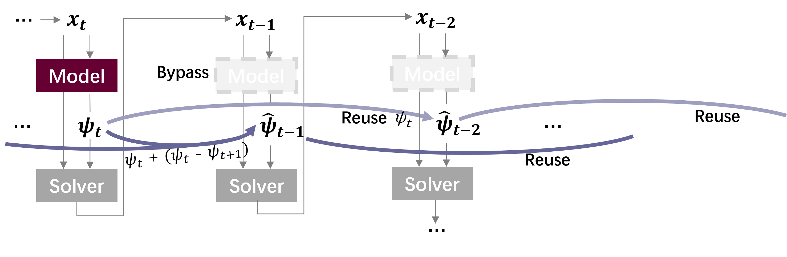

<div align="center">

## ⚡ ZEUS: Zero-shot Efficient Unified Sparsity

[Yixiao Wang*](https://yixiao-wang-stats.github.io/), 
[Ting Jiang*](https://github.com/Ting-Justin-Jiang), 
[Zishan Shao*](https://zishan-shao.github.io/), 
[Hancheng Ye*](https://github.com/HankYe), 
[Jingwei Sun*](https://jingwei-sun.com/), 
[Mingyuan Ma*](https://scholars.duke.edu/person/mingyuan.ma), 
[Jianyi Zhang*](https://jayzhang42.github.io/), 
[Yiran Chen*](https://ece.duke.edu/people/yiran-chen/), 
[Hai Li*](https://ece.duke.edu/people/hai-helen-li/)

[**Project Page**](https://yixiao-wang-stats.github.io/zeus/)

Duke University, \* Equal contribution.

</div>

**What does it minimally take to accelerate generative models—without training?**  
<p align="center">
  
</p>
*Fig.&nbsp;1. Overview of ZEUS pipeline.*

### ⚙️ Environment
⚡ZEUS can be directly adapted into any 🤗Huggingface Diffuser workflows. Start a new environment with:
```bash
conda create -n zeus python=3.10
conda activate zeus
pip install -r requirements.txt
```

### 🚀 Quickstarts
We provide the following demos to test **ZEUS**. Simply run:
```bash
python sd_demo.py 
```
```bash
python xl_demo.py 
```
```bash
python flux_demo.py 
```
```bash
python wan2_demo.py 
```
```bash
python cogvideo_demo.py 
```
---
with `--solver {dpm|euler}`， `--prompt`, and `--seed`

### 🧩 Zeus Patch: TL;DR

```python
from zeus import patch

patch.apply_patch(pipe,
  acc_range=(10, 45), # when to apply ZEUS
  interp_mode="psi",
  caching_mode="reuse_interp", # default: ZEUS pattrn

  denominator=3, # sparsity ratio
  modular=(0,1, ),

  lagrange_int=4, 
  lagrange_step=24,
  lagrange_term=4
)
```

## 📕 Citation

If you find this work useful, please cite our paper:

```bibtex
@misc{zeus2025,
  title        = {ZEUS: Zero-shot Efficient Unified Sparsity for Generative Models},
  author       = {Yixiao Wang and Ting Jiang and Zishan Shao and Hancheng Ye and Jingwei Sun and Mingyuan Ma and Jianyi Zhang and Yiran Chen and Hai Li},
  year         = {2025},
  howpublished = {https://yixiao-wang-stats.github.io/zeus/},
  note         = {Code and project page available at {https://github.com/Ting-Justin-Jiang/ZEUS}}
}
```

---

## 🍾 Acknowledgement
ZEUS codebase is build upon the excellent work of [SADA](https://github.com/Ting-Justin-Jiang/sada-icml), [Huggingface Diffuser](https://github.com/huggingface/diffusers) and [ToMeSD](https://github.com/dbolya/tomesd)

